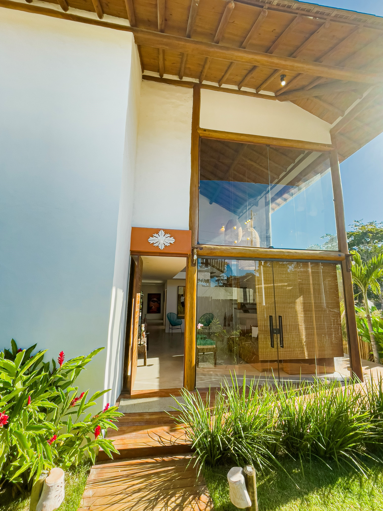

# 🏠 Landing Page | Casa de Luxo 🌟

Bem-vindo à casa dos seus sonhos! 🌅 Esta é a página de destino para a aluguel de uma casa de luxo inigualável. Desenvolvida com paixão, esta página tem tudo o que você precisa para atrair e cativar seus futuros hóspedes.

## 🎨 Design

O design foi meticulosamente criado no Figma, resultando em uma aparência deslumbrante e luxuosa. A página inclui:

* **Cabeçalho no Estilo "Hero":** Uma primeira impressão de tirar o fôlego!
* **Quatro Seções com Automações:** Reações dinâmicas graças ao React.js e Hooks.
* **Seção "Sobre":** Uma bela apresentação com texto e imagem, contando a história da casa.
* **Comodidades:** Utilizando Cards, mostramos tudo o que a casa tem a oferecer, com uma galeria para cada cômodo.
* **Dicas:** Um guia útil com um accordion interativo, graças ao MaterialUI.

## 🛠️ Tecnologias Utilizadas

* **HTML:** A espinha dorsal da web.
* **Styled-Components:** Estilização elegante e reutilizável.
* **JavaScript:** Tornando a página dinâmica e interativa.
* **React:** Componentização e manutenção eficientes.
* **React-Router:** Navegação suave entre as páginas.
* **MaterialUI:** Componentes modernos e interativos.
* **Vite:** Ferramenta de compilação incrivelmente rápida.

## 🚀 Como Começar

Quer conferir o código? Siga estes passos:

1. **Clone o Repositório**
2. 
git clone https://github.com/NickolasAbad/casa_trancoso.git

3. **Instale as Dependências**
4. 
npm install

5. **Rode o Projeto**
6. 
npm run dev

7. **Aproveite!** 🎉 Abra o navegador e visite `http://localhost:3000`.

## 🌐 Live Demo

[Visite a Landing Page](https://odaratrancoso.com.br/) e explore esta maravilhosa casa de luxo!

## 🤝 Contribuindo

Tem uma ideia brilhante? Sinta-se à vontade para abrir uma issue ou enviar um pull request.

## 📜 Licença

Este projeto está sob a licença MIT. Veja o arquivo [LICENSE](LICENSE) para mais detalhes.

---

Feito com 💖 e um toque de luxo! 🌟
Substitua seu-link-aqui pelo link para a página de destino, se desejar incluir uma demonstração ao vivo. Espero que este README atenda às suas necessidades! Se houver mais ajustes, estou aqui para ajudar.
